HTB Retired Machine

# **Strutted Machine**

#  \#Linux \#Nmap \#CVE-2023-50164 \#CVE-2024-53677 \#file-enumeration \#curl \#SSH \#tcpdump

# 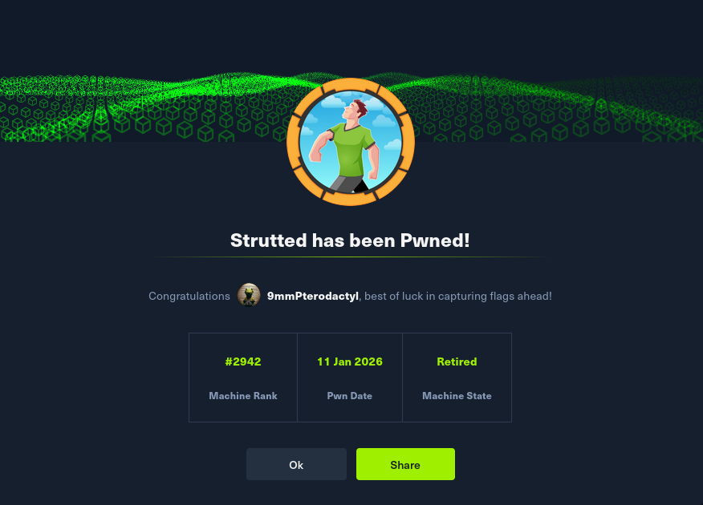

# 

# **Introduction**

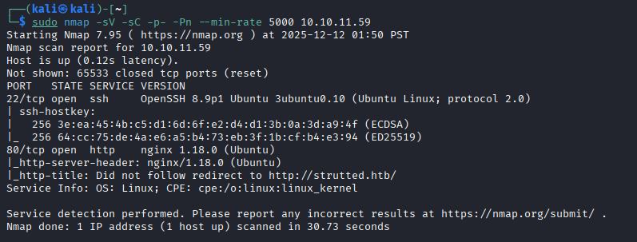

I start off with my standard CTF nmap scan, which reveals only ssh and the web server available to us, so I go ahead and check out the website. Immediately we are given a file upload function and an option to download the Docker environment for the web application. After downloading the docker environment, we see some placeholder tomcat credentials (that didn't work for anything) in the tomcat-users.xml file. 

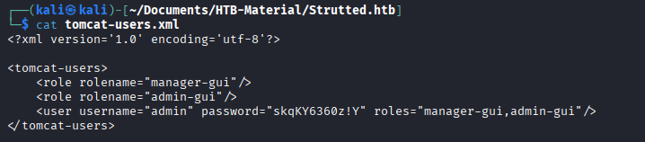

While reviewing other source code from our download, we see that this application is using an outdated MVC framework, Apache Struts Version 6.3.0.1, which is vulnerable to CVE-2023-50164 which allows for unauthorized path traversal and potential Remote Code Execution (RCE) via file upload manipulation. Along with CVE-2024-53677, another critical RCE vulnerability related to improper file upload logic, which has been actively exploited on live targets around the world.

## **Exploiting CVE-2023-50164 \- Apache Struts Path Traversal to RCE**

**CVE-2023-50164** is a path traversal vulnerability in Apache Struts 2 (versions 2.0.0 \- 2.3.37, 2.5.0 \- 2.5.32, and 6.0.0 \- 6.3.0) that allows attackers to manipulate file upload paths. When file upload functionality is enabled, attackers can bypass path restrictions by manipulating the `uploadFileName` parameter to write files outside the intended upload directory.

First, I identified the Struts configuration by examining accessible files:

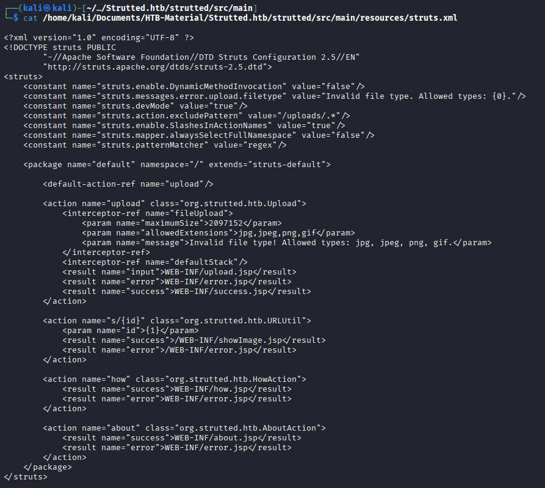

The application only accepts image file extensions, but doesn't validate actual file content.

I created a simple JSP webshell that executes system commands:

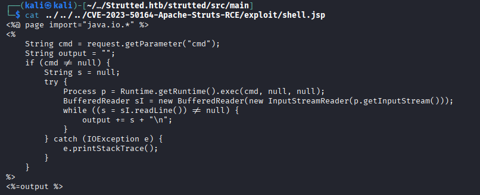

The vulnerability exists in how Struts handles the `uploadFileName` parameter. By using path traversal sequences (`../`), I could escape the intended upload directory and write the JSP file to the webroot with this curl command:

curl \-X POST http://strutted.htb/upload.action \\

  \-F "upload=@shell.jsp;type=image/jpeg" \\

  \-F "uploadFileName=../../shell.jsp"

The extension filtering is bypassed by including the image/jpeg type, and I add the traversal sequences to change the upload location. We confirm our webshell was uploaded and available for RCE by sending another curl command, a quick \`id\` which gives us the tomcat user:

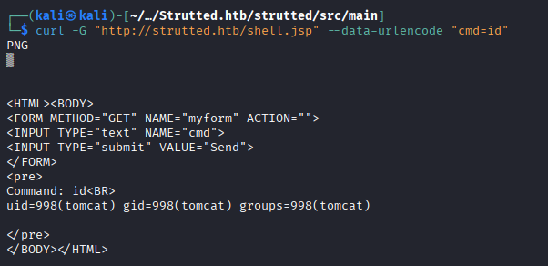

Another way we could use this RCE is directly in the URL of the web browser, which I did just for fun to read the /etc/passwd file:

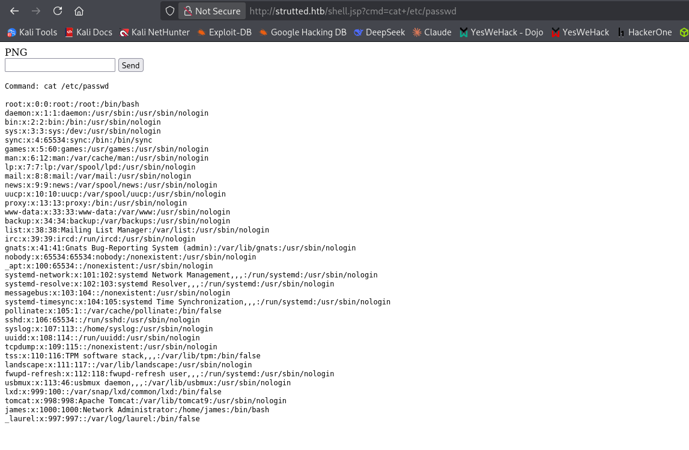

We then leverage this RCE to read files on the system and find this:

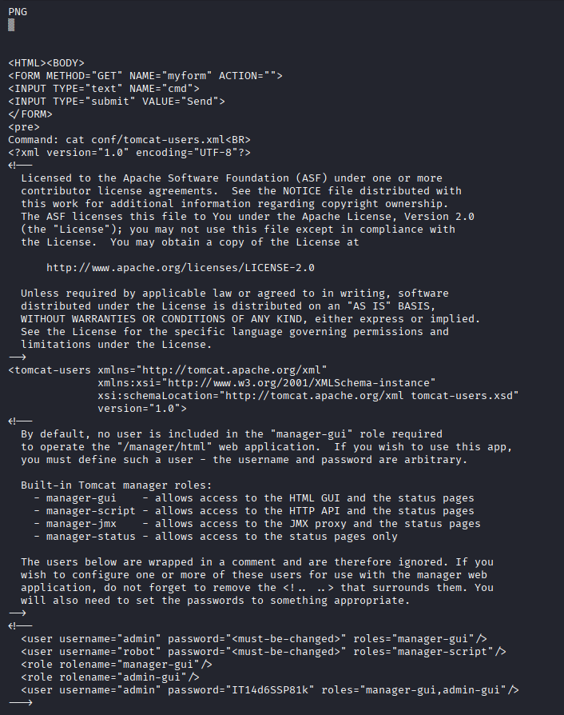

Combining these findings, we are able to authenticate to the ssh tunnel as the “james” user found in /etc/files with the password found in tomcat-users.xml, giving us an SSH shell and the user flag.

### **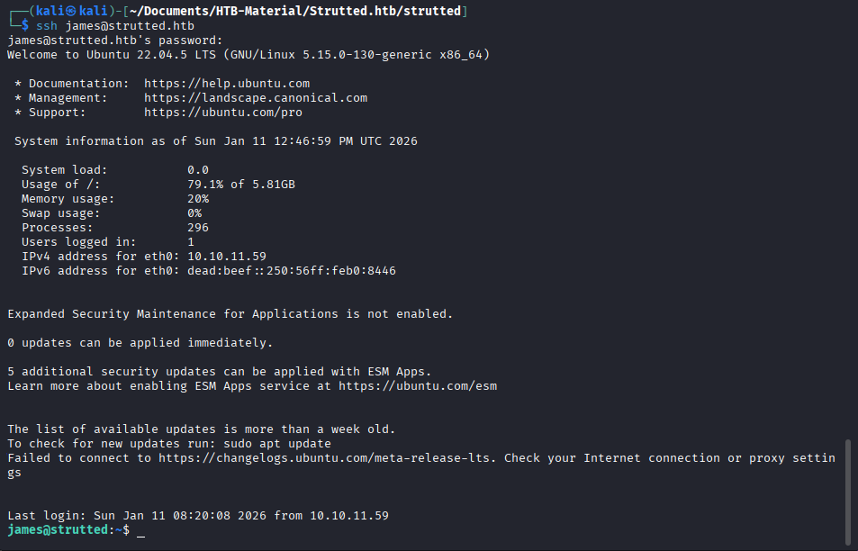**

### 

### **Root Escalation:**

First thing I usually do after getting a shell is checking sudo permissions with sudo \-l:

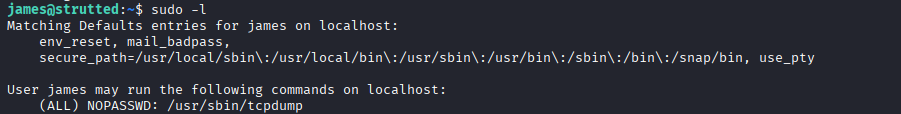  

The output revealed that user james could execute /usr/sbin/tcpdump with sudo privileges without requiring a password.

### **Understanding the Vulnerability**

`tcpdump` is a network packet capture utility that includes a `-z` flag for post-processing captured data. The `-z` option allows you to specify a command or script to execute after `tcpdump` rotates its output files or completes capture.

**The critical vulnerability:** When `tcpdump` is run with `sudo`, any command specified with the `-z` flag executes with **root privileges**, regardless of who initiated the tcpdump process.

The relevant tcpdump flags used in this exploit:

* `-z <command>` \- Execute this command after rotating capture files  
* `-W 1` \- Keep a maximum of 1 capture file (triggers rotation immediately)  
* `-G 1` \- Rotate capture files every 1 second (forces quick execution)  
* `-w /dev/null` \- Write captured packets to /dev/null (we don't need the actual capture)  
* `-Z root` \- Relinquish privileges to root after opening capture (maintains root context)

### **Exploitation Process**

Rather than attempting to spawn an interactive root shell directly (which can fail due to terminal handling issues), I used the SUID binary technique, by creating a malicious script named priv.sh

This script performs two actions when executed as root:

1. Copies `/bin/bash` to `/tmp/rootbash`  
2. Sets the SUID bit (`chmod +s`) on the copy, making it execute with the owner's (root's) privileges

We then run tcpdump with sudo permissions including our flags and malicious script, creating the SUID binary in /tmp/rootbash where we can then run it with the \-p flag (privileged mode) and get our root shell.

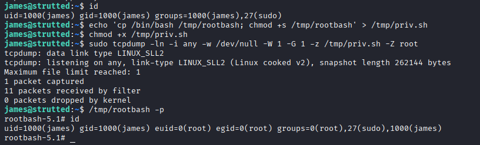

